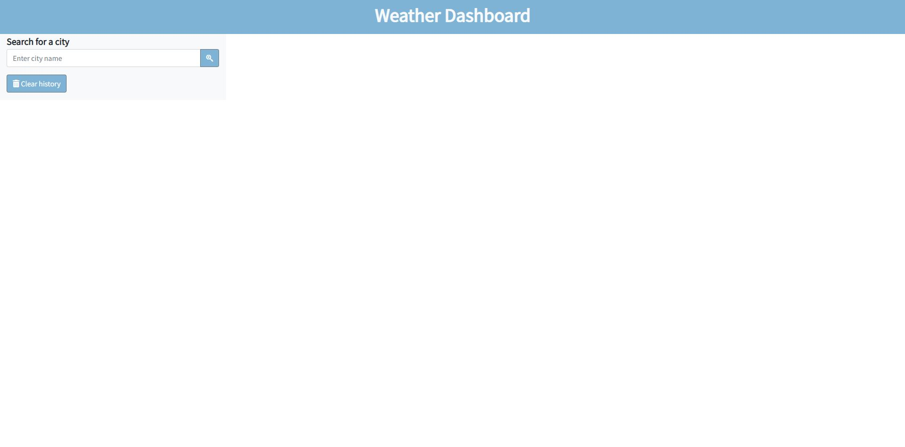
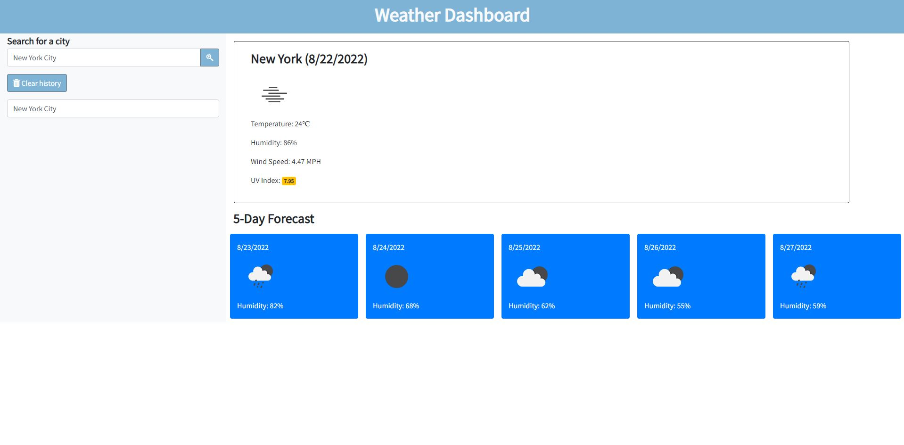
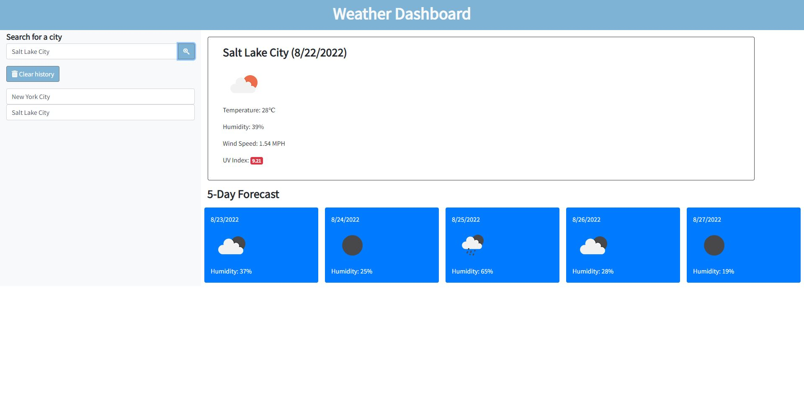
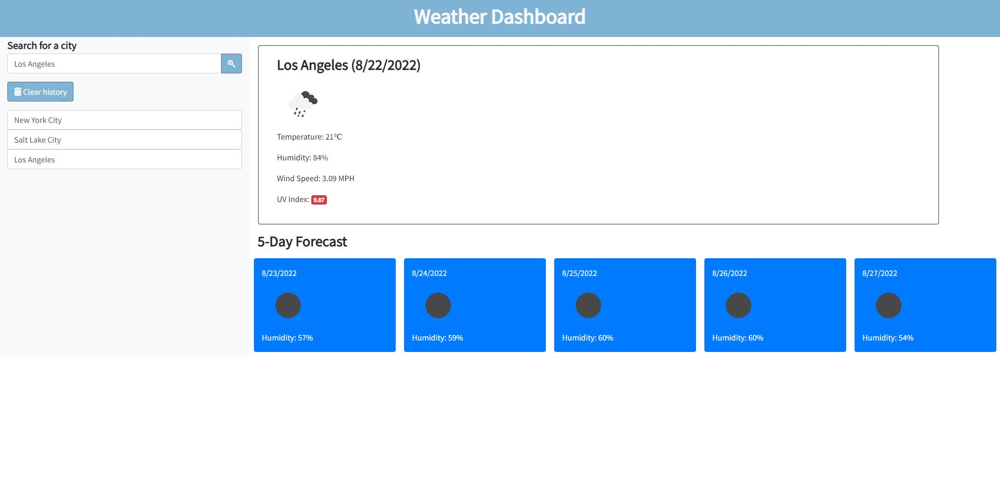

# Weather Dashboard

## Description
A simple web Weather Dashboard that allows users to search for a city to get the current weather and 5 days forecast. Cities previously searched are saved in local storage and results can be accessed again.

## Technologies used
- OpenWeather API
- Bootstrap
- JQuery
- Font Awesome
- Google Fonts

## Screen Shots

## Links
- GitHub: https://github.com/jasonsin88/weather-dashboard
- Deployed: https://jasonsin88.github.io/weather-dashboard